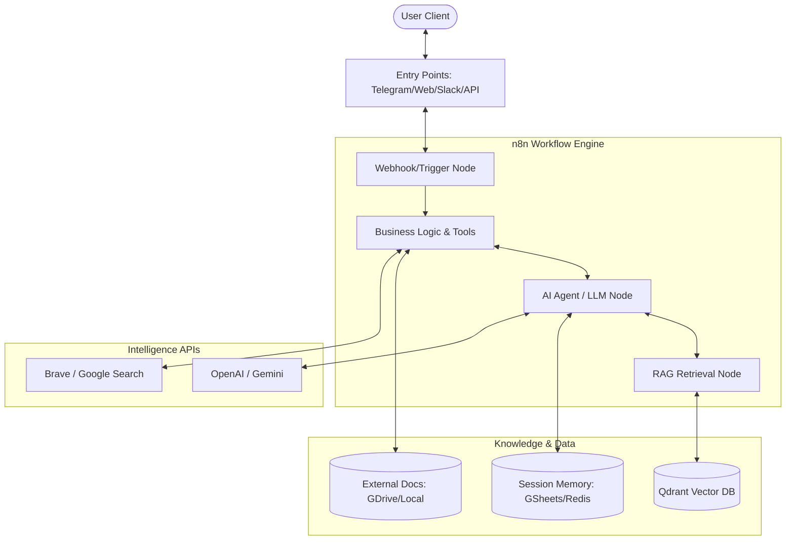

# Architecture Overview

**MySmartRAG-Bot** is built on a modular, high-performance architecture that combines n8n's visual workflow orchestration with modern AI technologies. This document outlines the system design, core components, and data flow patterns.

## Technical Stack

- **Orchestration**: n8n (v1.27+)
- **Large Language Models**: OpenAI GPT-4/4o, Google Gemini 2.0
- **Vector Database**: Qdrant / Supabase Vector
- **Frameworks**: LangChain (n8n native integration), Custom Python Utilities
- **Infrastructure**: Docker & Docker Compose
- **Data Integration**: Google Drive, Telegram, Slack, Web Search APIs

## System Architecture

## Core Components

### 1. Workflow Orchestration (n8n)
The central nervous system of the project. n8n handles the complex logic, asynchronous processing, and integration between dozens of services. Each workflow in `workflows/` is a self-contained automation unit.

### 2. Retrieval-Augmented Generation (RAG)
Our RAG implementation follows a high-density retrieval pattern:
- **Indexing Phase**: Documents are parsed, chunked, and transformed into high-dimensional embeddings using OpenAI's `text-embedding-3-small` or `large` models.
- **Storage**: Embeddings are stored in Qdrant collections with metadata for filtered retrieval.
- **Retrieval Phase**: User queries are embedded and matched against the vector database using cosine similarity.
- **Generation**: Top-K relevant context segments are injected into the LLM prompt to ensure grounded, factual responses.

### 3. AI Agent Framework
Workflows utilize n8n's "AI Agent" node which implements a ReAct (Reason + Act) loop. This allows the agent to:
- Use tools (Web search, DB query, Calculator)
- Maintain conversation state
- Decide on the best path to fulfill user requests

### 4. Memory Management
- **Short-Term Memory**: Handled via n8n's internal state during execution.
- **Long-Term Memory**: Implemented using external databases (Google Sheets, Redis, or PostgreSQL) to persist user sessions across multiple interactions.

## Data Flow Patterns

### Request-Response Flow
1. **Trigger**: Incoming webhook or message.
2. **Context Enrichment**: Retrieval of user profile and previous session memory.
3. **Retrieval**: Semantic search for context-specific information.
4. **Processing**: AI Agent analyzes the query and context.
5. **Action**: External tool calls (if needed) or direct response generation.
6. **Delivery**: Formatted response sent back to the user channel.

### Background Document Processing
1. **Source Monitor**: Polling or Webhook for new documents (e.g., Google Drive update).
2. **Parsing**: Extraction of text from PDF, Images (OCR), or text files.
3. **Chunking**: Recursive character splitting with overlap.
4. **Vectorization**: Large-scale embedding generation.
5. **Upsert**: Atomic update to the vector database.

## Security & Reliability

- **Credential Management**: All sensitive keys are stored in n8n's encrypted vault.
- **Rate Limiting**: Implemented via n8n's "Wait" and "Batch" nodes to respect API limits.
- **Error Handling**: Comprehensive retry logic and error-reporting workflows.
- **Environment Isolation**: `.env` driven configuration fordev/prod parity.

---

Developed by **Ahmed Abdelsalam**
